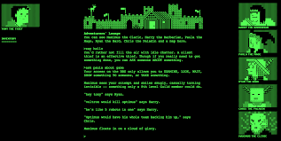

This was a computer science assignment done in my senior year of high school. The assignment was to create a text style RPG game. It had to include basic functions such as inheritance, loops, arrays, and so forth. My game used a turn-based system and it took inspiration from the video game “Dark Souls,” where you would have bosses to defeat, the player has access to things such as items and potions. The game needed to use inheritance, how there would be a player, and below those would be specialized classes such as knight, archer, bandit, etc. I based my class system off of a mobile game I was interested at the time “Fate/Grand Order.” Each different class having a difference in stats, having their own identity and gimmick. There is also a save system I implemented to save after every boss defeated, so the user does not have to start from the beginning after defeat.

This was a simple assignment used to access our knowledge of the topics we went over in our first semester. In all honesty, this was something that I am not proud, in terms of what I was able to produce. It relied heavily on my creativity, which is something I lacked at the time. I was trying more on the side of meeting requirements and the due date rather than experimenting and finding more creative ways to make the idea that I had to be better. Looking back at this assignment, something that I would like to try add would be a better/well-organized user interface. Along with graphics, showing more of the classes instead of it being plain words like “Warrior attacked Boss.” I want to believe that the topics that I am studying right now in software engineering would help me improve and maybe revise the ideas that I once had.
