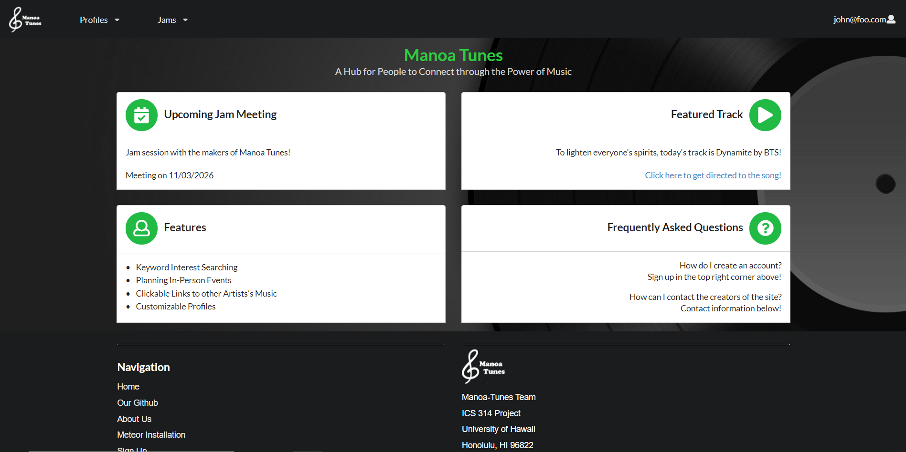

If I were to describe the final project for ICS 314: Software Engineering, it would be a trial. This project was the accumulation of everything we had gone over in the class. Every week we had a module building upon the knowledge of the previous week and at the end of the semester, that knowledge was put through a test. Our project had the theme of music, our goal was to develop an application that allowed users to come together who have similar interests or music tastes to perform or create music. In the beginning, I was a bit skeptical about the final project, due to previous stories and jokes about group work in college, but to my expectations, I believe that our final project and result was a huge success.

For me, my role in the project was creating the functionality for the profiles page, adding admin functions, and handling the deployment of the project. In the beginning, my knowledge of Meteor and MongoDB was minimal. When watching the screencasts and doing the homework assignments only laid a small foundation for the project. When my group first started we ran into many problems and had a long debugging session just to get a form to display the proper fields and pages. But I believe that if I did sit at my computer for a long period of time, testing and trying different things I would not have learned or gained anything. I think that the best way to learn something is to do it first-hand and struggle. After that, when working on other features and other parts of the project, I had a better understanding of how our application and Meteor works. It made me think about our project in different ways on the priority, what we can or can not implement, and how it would certain features would interact with others. For example, one feature of our website was to allow users to create a profile that displays the information they put in. One thing I realized at the time was how it would interact with our Jam feature, how users can create music groups. The question was whether we should allow users who have profiles created to **only** join Jams. It incentivized us to update and rework certain features of our project when we add something new. It was honestly troublesome and stressful at times, but I am satisfied with our final product and my group for being able to pull through with the workload.
  

  
While I do say I am satisfied with the result of the final project, I can not help to feel a desire to improve it even further. Due to the lack of time, our group had some ideas that we wanted to add to the project to make it stand out more, but we decided to cut those ideas all together since the due date was right around the corner. Some of those ideas were:
 - Adding a button that brings users back to the top of the page for profiles and jams
 - Sort profiles and Jams alphabetically
 - Allow users to add links to their YouTube, Spotify, or Soundcloud
 - Having an accept and invite functionality for jams
 - Adding functionality to the landing page and further improving its design
 
Sadly we were unable to implement these features, some due to the lack of time and others due to lack of knowledge and experience. But despite these small regrets, I believe that this project was a success. And hopefully, I get another chance or opportunity to do something similar in another class in the work field in the future.

See our deployed website: [Manoa Tunes Website](http://159.65.68.217/)  

See our project page: [Project Page](https://manoa-tunes.github.io/)

Find the Github Repo here: [Github Repo](https://github.com/manoa-tunes/manoa-tunes)    

